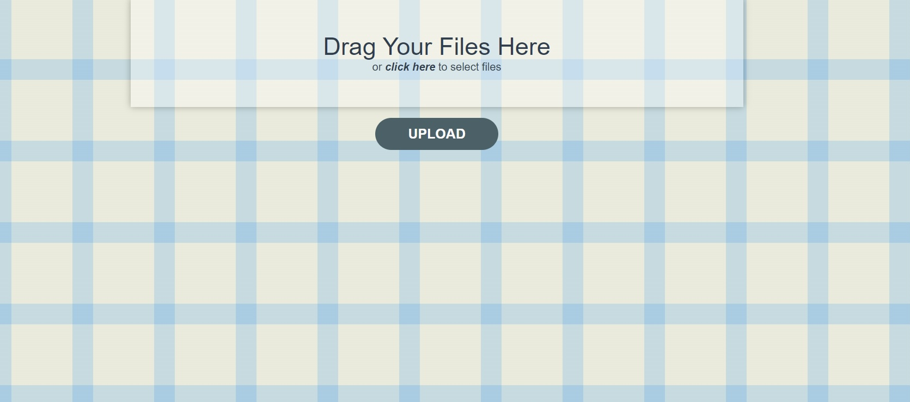
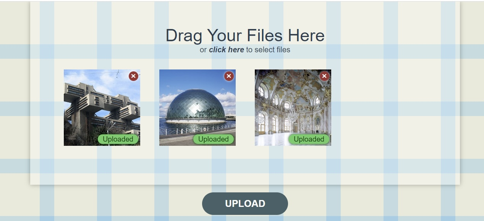
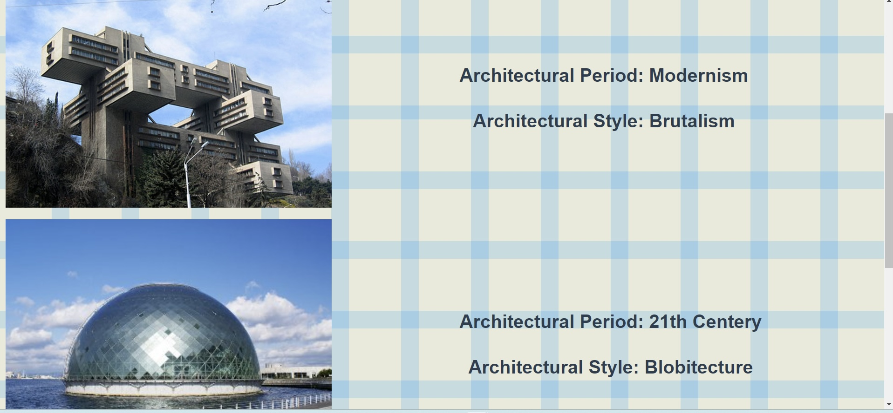

# Project Overview

This project employs transfer learning with the ResNet50 model to identify architectural styles in building images. After training the model on a diverse dataset covering various architectural styles, a web application was developed for easy utilization of this tool.

# Features
- Transfer Learning with ResNet50: Utilizes pre-trained ResNet50 model for architectural style recognition. The whole code for machine learning process is described in notebook ***neural_network_for_architecture_style.ipynb*** 

- Web Application with FastAPI and Vue.js: Interactive web app to upload images and identify architectural styles with a single button press. The code for web aplication is under ***services*** folder







# Usage with Docker Compose

To run the web application using Docker Compose, follow these steps:

1. **Clone the repository:**
    ```bash
    git clone [https://github.com/your-username/your-repository.git](https://github.com/parapapere/architecture-style-classification.git)
    ```

2. **Navigate to the project directory:**
    ```bash
    cd architecture-style-classification
    ```

3. **Build and run the Docker containers:**
    ```bash
    docker-compose up --build
    ```

4. **Open your web browser and go to [http://localhost:8080](http://localhost:8080) to use the application.**

# License

This project is licensed under the MIT License.
